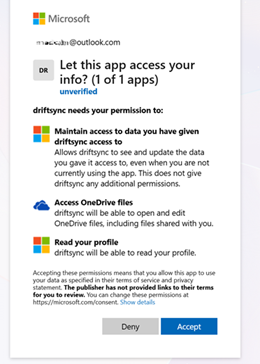
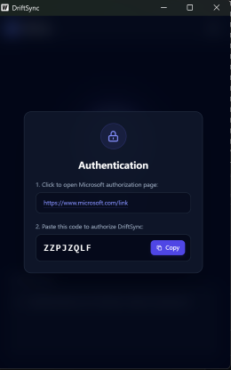
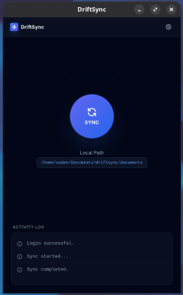

# DriftSync

`DriftSync` is a fast, reliable, incremental synchronization tool for **Microsoft OneDrive**. Powered by the OneDrive Delta API, it is optimized for large folder structures and low-change environments.

DriftSync offers both a **modern Graphical User Interface (GUI)** for desktop users and a **headless Command-Line Interface (CLI)** for servers, WSL, and Dev Containers.

# Screenshots







---

## Part 1: Capabilities & Features

### Modern Graphical User Interface (New!)
- Built with **Vue 3** and **Wails**, providing a sleek, native-feeling desktop experience.
- Interactive **Setup Wizard** to help you configure your local sync directory and authentication.
- Real-time **Dashboard** displaying sync progress, upload/download statistics, and beautifully color-coded logs.
- Interactive **Selective Sync** tree view: easily browse your OneDrive and check/uncheck folders to sync.

### Incremental Sync via Delta API
- Tracks file changes using the official OneDrive Delta API.
- Minimizes bandwidth usage and avoids re-uploading unchanged files by calculating local SHA-256 hashes and comparing them against the cloud.

### Flexible Local Metadata Store
- Keeps a persistent local database (`driftsync.db`) to store file hashes, timestamps, and delta tokens, ensuring safe resumes across runs.
- **Customizable Config Location:** By default, configuration (`config.yaml`) and database files are stored in the binary's directory, but you can set a custom global path via the GUI settings or the `~/.driftsync/workspace.txt` pointer file.

### Secure Authentication (Device Code Flow)
- Uses Microsoft's Device Code flow for login. No local browser dependencies or complex redirect URIs required.
- OAuth tokens are stored locally and refreshed automatically.

### Advanced Selective Sync
- **GUI:** Visually select exactly which folders you want to sync.
- **CLI/Config:** Use a YAML `sync:` block or a `.txt` file to define granular include/exclude rules (e.g., exclude `node_modules`, `*.tmp`, or hidden directories). **Exclude rules always take priority.**

### Safety & Trash System
- Modified local files are never silently overwritten by cloud changes. Conflict files are automatically created (e.g. `file.cloud-conflict-20240101.md`).
- Deleted files (both locally and remote) are moved to `.driftsync_trash/` before removal. They are **never permanently deleted** without your manual cleanup.
- System files (`.DS_Store`, `Thumbs.db`, `desktop.ini`) are automatically ignored.

### Cross-Platform Support
- Available as a standalone binary for **Linux**, **Windows**, and **macOS** (both Intel `amd64` and Apple Silicon `arm64`).
- No runtime dependencies like Python, Java, or heavy Electron frameworks.

---

## Part 2: Developer Guide (How to Compile)

DriftSync is split into two targets: the headless **CLI** and the Wails-powered **GUI**.

### Prerequisites

To build DriftSync from source, you will need:
1. **Go 1.25+**
2. **Node.js 20+** (Required only for the GUI)
3. **C/C++ Compiler & Dev Headers** (Required for the GUI on Linux/macOS)

**Linux Prerequisites (GUI Only):**
You must install the necessary C development headers to compile the webview binding. For example, on **OpenSUSE**:
```bash
sudo zypper install gcc pkgconfig gtk3-devel webkitgtk4-devel
```
*(Note: `webkitgtk4-devel` provides the modern `webkit2gtk-4.1` library. On Ubuntu/Debian, use `libgtk-3-dev libwebkit2gtk-4.1-dev`)*.

---

### Compiling the CLI

The CLI is a pure Go application (`CGO_ENABLED=0`).

```bash
# Clone the repository
git clone https://github.com/xiaochun-z/driftsync.git
cd driftsync

# Linux / macOS (Native)
CGO_ENABLED=0 go build -ldflags="-s -w" -o driftsync_cli ./cmd/driftsync

# Windows (Cross-compilation from Linux/macOS)
GOOS=windows GOARCH=amd64 CGO_ENABLED=0 go build -ldflags="-s -w" -o driftsync_cli.exe ./cmd/driftsync

# macOS (Cross-compilation from Linux/Windows for Apple Silicon)
GOOS=darwin GOARCH=arm64 CGO_ENABLED=0 go build -ldflags="-s -w" -o driftsync_cli_macos ./cmd/driftsync
```

---

###  Compiling the GUI (Wails)

The GUI requires **CGO** and the [Wails](https://wails.io/) toolkit. **Cross-compilation of macOS GUI apps from Windows/Linux is not supported by Wails.** You must compile the macOS app on a macOS machine.

```bash
# 1. Install the Wails CLI
go install github.com/wailsapp/wails/v2/cmd/wails@latest

# 2. Build the desktop application
wails build

# On modern Linux distros, compile with the newer WebKit API:
wails build -tags webkit2_41

# Embed a specific version string (e.g., v1.0.0) during compilation
wails build -ldflags "-X main.Version=v1.0.0"
```
The compiled graphical app will be placed in the `build/bin/` directory.

> ** Note for macOS Users:**
> Because DriftSync is an open-source tool distributed without an Apple Developer Signature, macOS Gatekeeper may report the GUI app as "damaged" or "from an unidentified developer" when you first try to open it. This is normal. To fix this and allow the app to run, open your Terminal and run the following command to remove the quarantine attribute:
> ```bash
> xattr -cr /path/to/DriftSync.app
> ```
> After running this command, you can double-click the app to open it normally.

---

### Configuration Reference (For CLI Users)

If you are bypassing the GUI, you can manually create a `config.yaml` file next to the binary:

```yaml
tenant: consumers           # "consumers" (personal), "common", or Azure tenant GUID
client_id: "<your-client-id>"
local_path: "/var/data/onedrive"

download_from_cloud: true
upload_from_local: true

download_workers: 8
upload_workers: 8
upload_chunk_mb: 8          # chunk size for large files
upload_parallel: 2          # max parallel chunks

interactive: false          # CLI prompt for conflicts

sync:
  include:
    - /docs
  exclude:
    - "*.tmp"
    - node_modules
```

Every configuration key can also be overridden via environment variables (e.g., `DRIFTSYNC_LOCAL_PATH`, `DRIFTSYNC_CLIENT_ID`).

---

## License
GNU General Public License v3.0 — see [LICENSE](LICENSE) for details.

## Contributions
Pull requests and feature suggestions are welcome!
